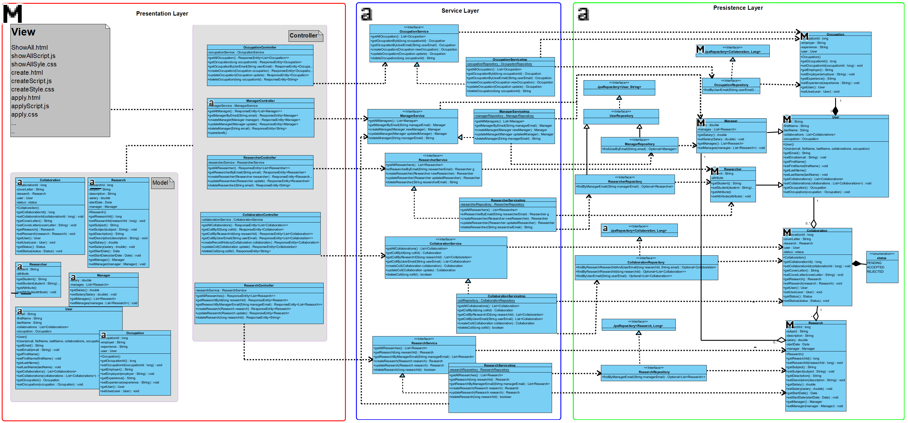
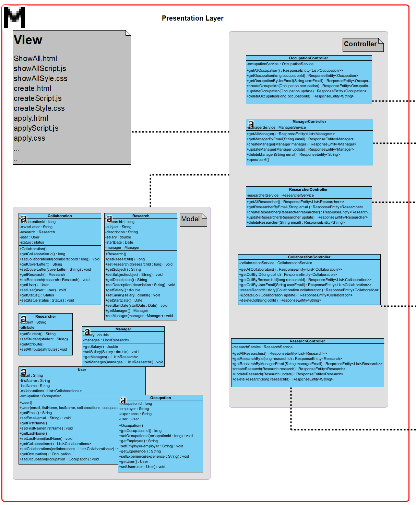
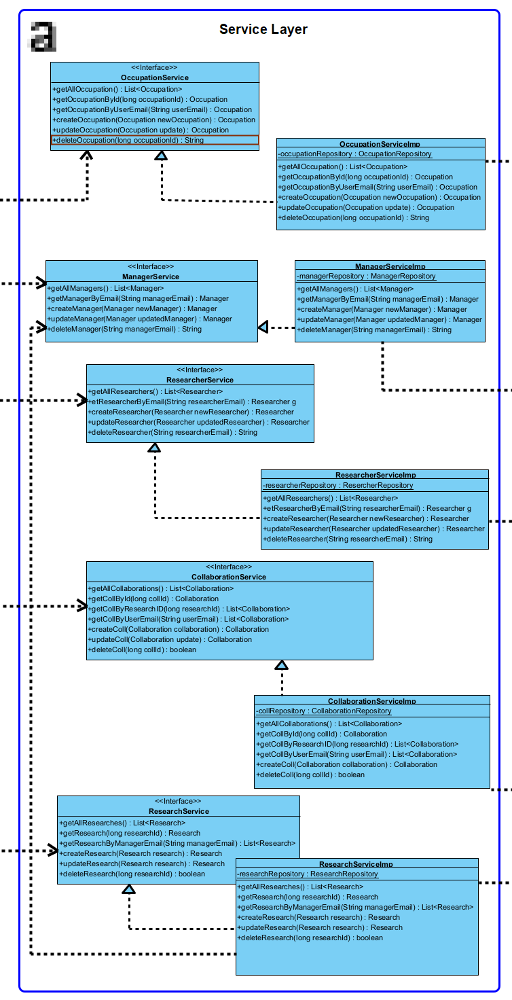
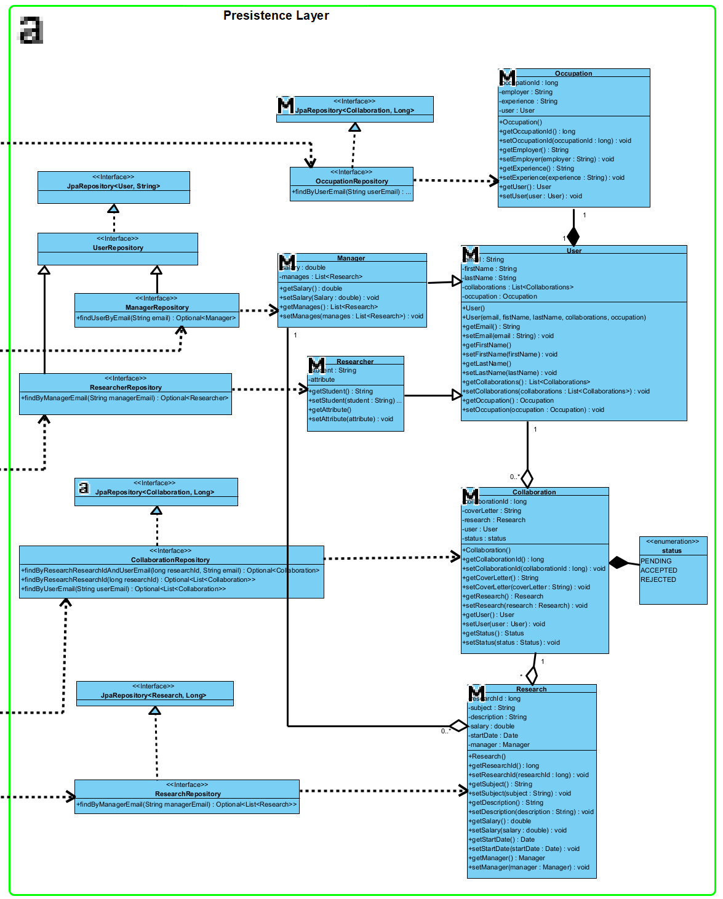

# Software Architecture And Engineering
Welcome to the Research Collaboration System, a platform where researchers can create collaboration opportunities, and users can apply for and manage those collaborations.

## Table of Contents

- [Introduction](#introduction)
- [Features](#features)
- [Requirements](#requirements)
- [Architecture](#architecture)
- [Class Diagram](#class-diagram)
- [Implementation Details](#implementation-details)
- [Technologies Used](#technologies-used)
- [API Endpoints](#api-endpoints)

## Introduction

This repository contains the implementation of a Research Collaboration System, allowing researchers to create collaboration opportunities, and users to apply for and manage those collaborations. The system facilitates the exchange of information, including occupation details, years of experience, and cover letters, enabling effective collaboration within the research community.

## Features

- Create, update, and delete collaboration opportunities
- Apply for collaboration opportunities
- View applicants and accept or reject them
- View results of applied research collaborations
- Cancel accepted or pending applications
- Update pending applications
- Add and remove occupation information

## Requirements

The following actions are supported by the system:

- User creates a collaboration opportunity
- User updates the research collaboration post
- User deletes the research collaboration post
- User applies for a collaboration opportunity
- User views applicants and accepts or rejects them
- User views the results of research collaborations they have applied to
- User cancels the accepted or pending application
- User updates the pending application
- User adds occupation information
- User removes occupation information

## Architecture

The system is designed using a layered architecture, comprising the presentation layer, service layer, and persistence layer. The Model-View-Controller (MVC) design pattern is employed to ensure a structured and maintainable codebase. General Responsibility Assignment Software Patterns (GRASP) design patterns are also incorporated for improved design clarity and modularity.

## Class Diagram

### Presentation Layer

### Service Layer

### Persistence Layer

## Implementation Details

The application is implemented in Java using the Spring Boot framework. Each requirement is addressed through dedicated API endpoints defined in the controller files. MySQL is utilized as the database, with JPA Repository managing database interactions. For Frontend we use HTML, Javascript, CSS technologies. 

## Technologies Used

- Java Spring Boot
- MySQL
- JPA Repository
- REST API
- HTML
- JavaScript
- CSS

## API Endpoints

### Collaboration API Endpoints

#### Get All Collaborators

- **Endpoint**: `/collaboration/getAll`
- **Method**: GET
- **Description**: Retrieves a list of all collaboration opportunities.
- **Response Codes**:
    - `200 OK`: Successful retrieval with a non-empty list.
    - `204 No Content`: Successful retrieval with an empty list.
    - `500 Internal Server Error`: Server error.

#### Get Collaboration by ID

- **Endpoint**: `/collaboration/getById`
- **Method**: GET
- **Parameters**: `collId` (long) - Collaboration ID
- **Description**: Retrieves a specific collaboration opportunity by its ID.
- **Response Codes**:
    - `200 OK`: Successful retrieval with the collaboration information.
    - `404 Not Found`: Collaboration not found.
    - `500 Internal Server Error`: Server error.

#### Get Collaborations by Research ID

- **Endpoint**: `/collaboration/getByResearchId`
- **Method**: GET
- **Parameters**: `researchId` (long) - Research ID
- **Description**: Retrieves collaborations associated with a specific research ID.
- **Response Codes**:
    - `200 OK`: Successful retrieval with a non-empty list.
    - `500 Internal Server Error`: Server error.

#### Get Collaborations by User Email

- **Endpoint**: `/collaboration/getByUserEmail`
- **Method**: GET
- **Parameters**: `userEmail` (String) - User's email
- **Description**: Retrieves collaborations associated with a specific user's email.
- **Response Codes**:
    - `200 OK`: Successful retrieval with a non-empty list.
    - `500 Internal Server Error`: Server error.

#### Create Collaboration Opportunity

- **Endpoint**: `/collaboration/create`
- **Method**: POST
- **Request Body**: JSON representation of a `Collaboration` object
- **Description**: Creates a new collaboration opportunity.
- **Response Codes**:
    - `201 Created`: Successful creation with the created collaboration information.
    - `302 Found`: Collaboration creation failed.
    - `500 Internal Server Error`: Server error.

#### Update Collaboration Opportunity

- **Endpoint**: `/collaboration/update`
- **Method**: PUT
- **Request Body**: JSON representation of an updated `Collaboration` object
- **Description**: Updates an existing collaboration opportunity.
- **Response Codes**:
    - `202 Accepted`: Successful update with the updated collaboration information.
    - `404 Not Found`: Collaboration not found.
    - `500 Internal Server Error`: Server error.

#### Delete Collaboration Opportunity

- **Endpoint**: `/collaboration/delete`
- **Method**: DELETE
- **Parameters**: `collId` (long) - Collaboration ID
- **Description**: Deletes a collaboration opportunity by its ID.
- **Response Codes**:
    - `200 OK`: Successful deletion.
    - `404 Not Found`: Collaboration not found.
    - `500 Internal Server Error`: Server error.

### Manager API Endpoints

#### Get All Managers

- **Endpoint**: `/manager/getAll`
- **Method**: GET
- **Description**: Retrieves a list of all managers.
- **Response Codes**:
    - `200 OK`: Successful retrieval with a non-empty list.
    - `500 Internal Server Error`: Server error.

#### Get Manager by Email

- **Endpoint**: `/manager/getByEmail`
- **Method**: GET
- **Parameters**: `email` (String) - Manager's email
- **Description**: Retrieves a specific manager by their email.
- **Response Codes**:
    - `200 OK`: Successful retrieval with the manager information.
    - `404 Not Found`: Manager not found.
    - `500 Internal Server Error`: Server error.

#### Create Manager

- **Endpoint**: `/manager/create`
- **Method**: POST
- **Request Body**: JSON representation of a `Manager` object
- **Description**: Creates a new manager.
- **Response Codes**:
    - `201 Created`: Successful creation with the created manager information.
    - `302 Found`: Manager creation failed.
    - `500 Internal Server Error`: Server error.

#### Update Manager

- **Endpoint**: `/manager/update`
- **Method**: PUT
- **Request Body**: JSON representation of an updated `Manager` object
- **Description**: Updates an existing manager.
- **Response Codes**:
    - `202 Accepted`: Successful update with the updated manager information.
    - `404 Not Found`: Manager not found.
    - `500 Internal Server Error`: Server error.

#### Delete Manager

- **Endpoint**: `/manager/delete`
- **Method**: DELETE
- **Parameters**: `email` (String) - Manager's email
- **Description**: Deletes a manager by their email.
- **Response Codes**:
    - `200 OK`: Successful deletion.
    - `404 Not Found`: Manager not found.
    - `500 Internal Server Error`: Server error.

### Research API Endpoints

#### Get All Researches

- **Endpoint**: `/research/getAll`
- **Method**: GET
- **Description**: Retrieves a list of all research projects.
- **Response Codes**:
    - `200 OK`: Successful retrieval with a non-empty list.
    - `500 Internal Server Error`: Server error.

#### Get Research by ID

- **Endpoint**: `/research/getById`
- **Method**: GET
- **Parameters**: `researchId` (long) - Research ID
- **Description**: Retrieves a specific research project by its ID.
- **Response Codes**:
    - `200 OK`: Successful retrieval with the research information.
    - `404 Not Found`: Research not found.
    - `500 Internal Server Error`: Server error.

#### Get Researches by Manager Email

- **Endpoint**: `/research/researchesByManager`
- **Method**: GET
- **Parameters**: `managerEmail` (String) - Manager's email
- **Description**: Retrieves research projects associated with a specific manager's email.
- **Response Codes**:
    - `200 OK`: Successful retrieval with a non-empty list.
    - `404 Not Found`: Research projects not found.
    - `500 Internal Server Error`: Server error.

#### Create Research Project

- **Endpoint**: `/research/create`
- **Method**: POST
- **Request Body**: JSON representation of a `Research` object
- **Description**: Creates a new research project.
- **Response Codes**:
    - `201 Created`: Successful creation with the created research information.
    - `302 Found`: Research creation failed.
    - `500 Internal Server Error`: Server error.

#### Update Research Project

- **Endpoint**: `/research/update`
- **Method**: PUT
- **Request Body**: JSON representation of an updated `Research` object
- **Description**: Updates an existing research project.
- **Response Codes**:
    - `200 OK`: Successful update with the updated research information.
    - `404 Not Found`: Research not found.
    - `500 Internal Server Error`: Server error.

#### Delete Research Project

- **Endpoint**: `/research/delete`
- **Method**: DELETE
- **Parameters**: `researchId` (long) - Research ID
- **Description**: Deletes a research project by its ID.
- **Response Codes**:
    - `200 OK`: Successful deletion.
    - `404 Not Found`: Research not found.
    - `500 Internal Server Error`: Server error.

### Occupation API Endpoints

#### Get All Occupations

- **Endpoint**: `/occupation/getAll`
- **Method**: GET
- **Description**: Retrieves a list of all occupations.
- **Response Codes**:
    - `200 OK`: Successful retrieval with a non-empty list.
    - `500 Internal Server Error`: Server error.

#### Get Occupation by ID

- **Endpoint**: `/occupation/getById`
- **Method**: GET
- **Parameters**: `occupationId` (long) - Occupation ID
- **Description**: Retrieves a specific occupation by its ID.
- **Response Codes**:
    - `200 OK`: Successful retrieval with the occupation information.
    - `404 Not Found`: Occupation not found.
    - `500 Internal Server Error`: Server error.

#### Get Occupation by User Email

- **Endpoint**: `/occupation/getByUserEmail`
- **Method**: GET
- **Parameters**: `userEmail` (String) - User's email
- **Description**: Retrieves the occupation associated with a specific user's email.
- **Response Codes**:
    - `200 OK`: Successful retrieval with the occupation information.
    - `404 Not Found`: Occupation not found.
    - `500 Internal Server Error`: Server error.

#### Create Occupation

- **Endpoint**: `/occupation/create`
- **Method**: POST
- **Request Body**: JSON representation of an `Occupation` object
- **Description**: Creates a new occupation.
- **Response Codes**:
    - `201 Created`: Successful creation with the created occupation information.
    - `400 Bad Request`: Invalid request or missing data.
    - `500 Internal Server Error`: Server error.

#### Update Occupation

- **Endpoint**: `/occupation/update`
- **Method**: PUT
- **Request Body**: JSON representation of an updated `Occupation` object
- **Description**: Updates an existing occupation.
- **Response Codes**:
    - `202 Accepted`: Successful update with the updated occupation information.
    - `404 Not Found`: Occupation not found.
    - `500 Internal Server Error`: Server error.

#### Delete Occupation

- **Endpoint**: `/occupation/delete`
- **Method**: DELETE
- **Parameters**: `occupationId` (long) - Occupation ID
- **Description**: Deletes an occupation by its ID.
- **Response Codes**:
    - `200 OK`: Successful deletion.
    - `404 Not Found`: Occupation not found.
    - `500 Internal Server Error`: Server error.

### Researcher API Endpoints

#### Get All Researchers

- **Endpoint**: `/researcher/getAll`
- **Method**: GET
- **Description**: Retrieves a list of all researchers.
- **Response Codes**:
    - `200 OK`: Successful retrieval with a non-empty list.
    - `500 Internal Server Error`: Server error.

#### Get Researcher by Email

- **Endpoint**: `/researcher/getByEmail`
- **Method**: GET
- **Parameters**: `email` (String) - Researcher's email
- **Description**: Retrieves a specific researcher by their email.
- **Response Codes**:
    - `200 OK`: Successful retrieval with the researcher information.
    - `404 Not Found`: Researcher not found.
    - `500 Internal Server Error`: Server error.

#### Create Researcher

- **Endpoint**: `/researcher/create`
- **Method**: POST
- **Request Body**: JSON representation of a `Researcher` object
- **Description**: Creates a new researcher.
- **Response Codes**:
    - `201 Created`: Successful creation with the created researcher information.
    - `302 Found`: Researcher creation failed.
    - `500 Internal Server Error`: Server error.

#### Update Researcher

- **Endpoint**: `/researcher/update`
- **Method**: PUT
- **Request Body**: JSON representation of an updated `Researcher` object
- **Description**: Updates an existing researcher.
- **Response Codes**:
    - `202 Accepted`: Successful update with the updated researcher information.
    - `404 Not Found`: Researcher not found.
    - `500 Internal Server Error`: Server error.

#### Delete Researcher

- **Endpoint**: `/researcher/delete`
- **Method**: DELETE
- **Parameters**: `email` (String) - Researcher's email
- **Description**: Deletes a researcher by their email.
- **Response Codes**:
    - `200 OK`: Successful deletion.
    - `404 Not Found`: Researcher not found.
    - `500 Internal Server Error`: Server error.
